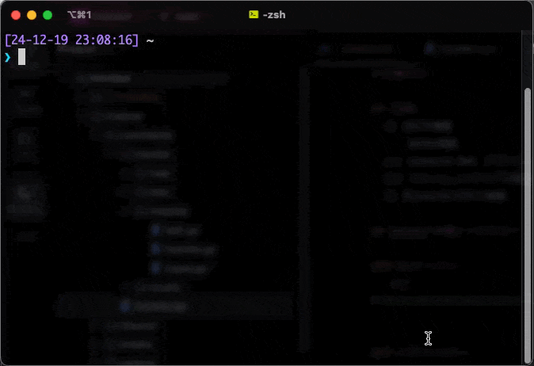

# ToLOVE-ru

A lovely terminal heart animation (pronounced as "trouble") 💜

Watch a heart float up in your terminal with optional messages inside!



## Installation

### Pre-built binaries

You can download pre-built binaries for various platforms from the [GitHub releases page](https://github.com/hidari/tolove-ru/releases).

### From source

```bash
cargo install tolove-ru
```

## Usage

Just run:
```bash
love
```

### Options

- `--message <TEXT>` - Display a message inside the heart
- `--petite` - Show a smaller heart
- `-h, --help` - Show help message

### Examples

Basic usage:
```bash
love
```

With a message:
```bash
love --message "I love Rust"
```

Small heart:
```bash
love --petite
```

## License

This project is licensed under the MIT License - see the LICENSE file for details.
